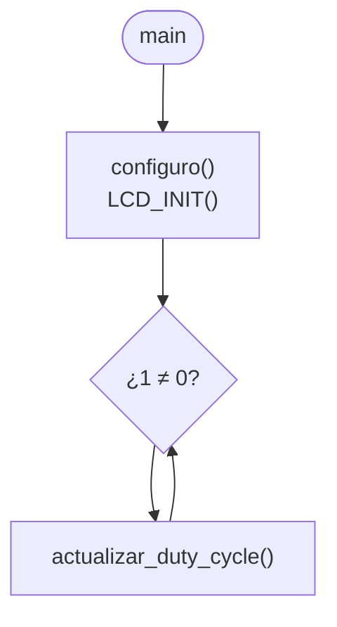
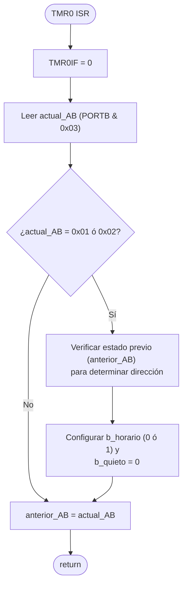

# PIC18F47Q10 – LED Intensity Control (LCD16x2 + KY-040)

> [!NOTE]
> Este proyecto forma parte de [**TheAssemblyChronicles-PIC**](https://remgo696.github.io/TheAssemblyChronicles-PIC/), una serie de proyectos, documentación y guías rápidas orientadas al aprendizaje de los microcontroladores PIC18F. 
Puedes encontrar más proyectos [aquí](https://remgo696.github.io/TheAssemblyChronicles-PIC/proyectos/).

---

## Descripción del Proyecto

Se implementa un controlador de intensidad lumínica (Dimmer) para un LED sobre la placa **PIC18F47Q10 Curiosity Nano**, integrando una pantalla **LCD 16x2** y un **Encoder Rotativo (KY-040)**. Girando el encoder, el usuario aumenta o reduce la intensidad del LED (modificando el *duty cycle* del PWM), al tiempo que observa el porcentaje de intensidad aplicado en tiempo real en el LCD.

Para lograrlo se emplean los siguientes periféricos:

| Periférico | Función |
|:-----------|:--------|
| **Oscilador** | Reloj del sistema a 4 MHz |
| **PORTB y PORTA** | Lectura del encoder (entradas) y salida PWM |
| **TMR0** | Genera una interrupción periódica para leer los estados del encoder y decodificar el giro |
| **PWM3 + TMR2** | Señal PWM de periodo 200 µs (5 kHz) cuyo *duty cycle* es regulado por el programa |
| **Librería LCD** | Controla una pantalla LCD de 16x2 para visualizar la información |

La salida del PWM se dirige al pin **RA0** mediante el módulo PPS.

---

## Configuración del Reloj del Sistema (4 MHz)

Se utiliza el oscilador interno de alta frecuencia (HFINTOSC) configurado a 4 MHz. Para ello se establecen tres registros.

### Registros del Oscilador

**OSCCON1** – Oscillator Control Register 1

| Bit | 7 | 6:4 | 3:0 |
|:---:|:---:|:---:|:---:|
| **Campo** | — | NOSC[2:0] | NDIV[3:0] |

**OSCFRQ** – HFINTOSC Frequency Selection Register

| FRQ[2:0] | Frecuencia HFINTOSC |
|:--------:|:-------------------:|
| 001 | 2 MHz |
| 010 | 4 MHz |
| ... | ... |

**OSCEN** – Oscillator Enable Register

| Bit | 7 | 6 | 5 | 4 | 3 | 2 | 1:0 |
|:---:|:---:|:---:|:---:|:---:|:---:|:---:|:---:|
| **Campo** | EXTOEN | HFOEN | MFOEN | LFOEN | SOSCEN | ADOEN | — |

### Valores seleccionados

| Registro | Valor | Justificación |
|:--------:|:-----:|:--------------|
| `OSCCON1` | `0x60` | NOSC = 110 (HFINTOSC), NDIV = 0000 (1:1) |
| `OSCFRQ`  | `0x02` | FRQ = 010 → 4 MHz |
| `OSCEN`   | `0x40` | HFOEN = 1 → habilitar HFINTOSC |

```c
OSCCON1 = 0x60;  // HFINTOSC, sin divisor
OSCFRQ  = 0x02;  // 4 MHz
OSCEN   = 0x40;  // Habilitar HFINTOSC
```

---

## Configuración del Encoder (KY-040) y TMR0

El encoder rotativo genera pulsos desfasados en sus pines A y B (conectados a `RB0` y `RB1`). Para leerlos sin aplicar retardos perjudiciales (debouncing por hardware/software bloqueante), se utiliza un muestreo cíclico basado en la interrupción del TMR0.

El oscilador interno de frecuencia media MFINTOSC es de 500 kHz.

### Cálculos del TMR0

Se configura el reloj con la fuente MFINTOSC y prescaler 1:4.

$$f_{in} = \frac{500\ \text{kHz}}{4} = 125\ \text{kHz} \quad (T_{in} = 8\ \mu\text{s})$$

Se asigna el registro de periodo del Timer0 a 100 (`TMR0H = 100`). La frecuencia de interrupción (modo 8 bits) se calcula como:

$$f_{int} = \frac{f_{in}}{TMR0H + 1} = \frac{125\,000}{101} \approx 1237\ \text{Hz} \quad (T_{int} \approx 0{,}8\ \text{ms})$$

Este muestreo periódico (~1.2 kHz) asegura detectar correctamente la rotación del encoder sin perder estados.

```c
// Configuración TMR0
T0CON0 = 0x80;  // TMR0 ON, 8-bit mode, postscaler 1:1
T0CON1 = 0xD3;  // MFINTOSC (500 kHz), síncrono, prescaler 1:4
TMR0H  = 100;   // Periodo para interrupción
```

---

## Configuración del Módulo PWM3

La señal PWM controla la potencia que llega al LED. Su periodo $T_{PWM} = 200\ \mu s$ (equivalente a $5\ \text{kHz}$) se configura mediantes el **TMR2**.

### Periodo y Duty Cycle

Con $F_{osc} = 4\ \text{MHz}$ (o sea, frecuencia de instrucciones de $1\ \text{MHz}$) y Prescaler del TMR2 de 1:1:

$$T2PR = \frac{T_{PWM} \times (F_{osc}/4)}{Prescaler_{TMR2}} - 1 = \frac{200 \times 10^{-6} \times 1 \times 10^{6}}{1} - 1 = 199$$

Un aumento de intensidad del 1 % representa un tiempo en alto de:

$$T_{ON}(1\\%) = \frac{200\ \mu\text{s}}{100} = 2\ \mu\text{s}$$

El registro `PWM3DCH:PWM3DCL` maneja el *Duty Cycle* con resolución de 10 bits. Representar un tiempo en alto de $2\ \mu\text{s}$:
$$\text{Valor}(1\\%) = T_{ON} \times F_{osc} = 2 \times 10^{-6} \times 4 \times 10^{6} = 8_{(10)} = 00\ 0000\ 1000_{(2)}$$
El registro alto de los módulos `PWMx` guarda los 8 bits más significativos. El registro DCL guarda los 2 bits menos significativos. Así, el valor $8$, alineado correctamente, requiere sumar **2 a `PWM3DCH`** para incrementar el Duty Cycle en un 1%.

```c
/* PPS: PWM3 → RA0 */
RA0PPS = 0x07;             // Dirigir salida PWM3 al pin RA0
TRISAbits.TRISA0 = 0;      // RA0 como salida
ANSELAbits.ANSELA0 = 0;    // RA0 como digital

/* PWM3 + TMR2 */
PWM3CON = 0x00;           // Disable PWM3 initially
T2PR = 199;               // Periodo PWM = 200 µs (5 kHz)
PWM3DCH = 0x00;
PWM3DCL = 0x00;           // Duty cycle inicial = 0 %
T2CLKCON = 0x01;          // Fuente reloj TMR2 = Fosc/4 (1 MHz)
T2CON = 0x80;             // TMR2 ON, prescaler 1:1
PWM3CONbits.EN = 1;       // Enable PWM3 
```

---

## Programa y Lógica

### Flujo Principal

La función `main` inicializa los periféricos y el LCD. A continuación, un bucle infinito llama a `actualizar_duty_cycle()` constantemente. Esta función comprueba banderas generadas por la interrupción y realiza las actualizaciones matemáticas al registro del PWM y al display LCD cuando se detecta un movimiento del encoder. El avance/retroceso se realiza en *pasos del 2%* (`DUTY_CYCLE_PASOS`).



### Rutina de interrupción (Lectura del Encoder)

El TMR0 desborda periódicamente y lee el puerto del encoder. De esta forma decodifica la dirección del giro (`b_horario`) y activa la bandera general `b_quieto = 0` para avisar al programa principal de que ha habido movimiento.



---

## Licencia

Este proyecto se distribuye bajo la licencia [MIT](LICENSE).